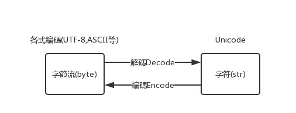

# 編碼

這節我們來討論字串中最麻煩的一個東西-編碼，為何要有編碼呢？其實歪頭想一想就知道原因，那就是計算機僅能處理數字，因此想要處理字串的話，就必須將其轉換為相應的數字，也就是所謂的「編碼」。

在最早的時候，計算機是採用8個Bit來處理一個字節\(Byte\)，所以一個字節能表達的最大整數就是255\(11111111\)，因此若要表達更多的數字，就必須用更多的字節\(例如：兩個字節所表達的最大整數為1111111111111111 --&gt; 65535\)。最初計算機是設計為處理127個字節\(處理英文大小寫字母與符號\)，也就是所謂的ASCII編碼。但顯然地，世界各地有那麼多語言，怎麼可以只有英文呢？因此，很快地，各國都發展出自己語言的編碼\(如日本的Shift\_JIS、大陸的GBK2312等\)，但問題又出來了，要怎麼讓這些語言\(編碼\)溝通呢？

綜合上述原因，Unicode編碼誕生了，他將世界不同語言編進去，成為編碼界的霸主\(還是編碼XD\)。

## Unicode

在Unicode的世界中，通常都是使用兩個字節來表達一個字符，而比較生僻冷門的字則可能會使用到四個字節。  
  
像是字符A的ASCII碼為65\(01000001\)，若要表達為Unicode碼，則直接在前面補0，結果為00000000 01000001。但問題又來了，若你打的字只含英文，這樣豈不是非常耗空間嗎？儲存與處理上的成本相當不划算啊！  
  
基於這個問題，UTF-8編碼橫空出世，其會將Unicode編碼根據不同數字大小編成1~6個字節，如此可自動變更長度的作法，非常的值回票價，如下例就可以很明顯感受到他的好。

| 字符 | Unicode | UTF-8 |
| --- | --- | --- |
| A | 00000000 01000001 | 01000001 |
| 修 | 01001111 11101110 | 11100100 10111111 10101110 |

```text
>>> a = '修'
# 在Python3中，字串預設皆使用unicode編碼。

>>> a.encode('utf-8')
b'\xe4\xbf\xae'
>>> a = a.encode('utf-8')
>>> bin(int(a.hex(),16))
>>> '0b111001001011111110101110'
# 取得UTF-8編碼
# hex()函式可以將位元組轉換為相應的十六進制表示字串。

>>> bytes.fromhex('e4bfae')
b'\xe4\xbf\xae'
# 可以再轉換回來相應位元組。

>>> ord(a)
20462
# 使用ord()函式可以得到該字符的整數表示。
>>> chr(20462)
'修'
# 使用chr()函式可以將整數轉換為相應的字符。
```

> 由上述可以看到，ASCII其實可以沿用舊制的，並無改變，這樣可以讓過去建置的系統能繼續使用。

> 在計算機內存中可以統一使用Unicode編碼，但在儲存、傳輸時就轉換為UTF-8編碼的位元組\(Bytes\)--&gt;以字節為單位。

```text
a = b'abc'
# 在字串前加上b的前綴字，即可將該字串轉換為位元組。
```

## 編碼/解碼

在預設情況下，Python3的字串皆為Unicode，編碼/解碼皆採用UTF-8編碼。若要將字串轉換為其他指定編碼的位元組\(Byte\)，可以使用encode\( \)函式。

```text
a = 'abc'.encode('ascii')
print(a)
輸出結果：
b'abc'

b = '一修'.encode('ascii')
輸出結果：
Traceback (most recent call last):
    File "<stdin>", line 1, in <module>
UnicodeEncodeError: 'ascii' codec can't encode characters in position 0-1: ordinal not in range(128)
# 上例錯誤的原因在於中文字超出ASCII編碼的範圍。

c = '一修'.encode('utf-8')
print(c)
輸出結果：
b'\xe4\xb8\x80\xe4\xbf\xae'
```

當然，我們亦可使用decode\( \)函式將這些位元組解碼還原為Unicode編碼。

```text
print(b'abc'.decode('ascii'))
輸出結果：
abc

print(b'\xe4\xb8\x80\xe4\xbf\xae'.decode('utf-8'))
輸出結果：
一修

print(b'\xe4\xb8\xad\x87'.decode('utf-8'))
輸出結果：
Traceback (most recent call last):
    File "<stdin>", line 1, in <module>
UnicodeDecodeError: 'utf-8' codec can't decode byte 0x87 in position 3: invalid start byte
# 上例錯誤原因在於存在某些無法被解碼的字節。
```

那麼針對上述代碼的最後一個例子，若錯誤的字節僅有一小部分，則可使用ignore來忽略這些錯誤，如下：

```text
print(b'\xe4\xb8\xad\x87'.decode('utf-8',errors='ignore'))
輸出結果：
中
```

## 字串/位元組長度

相同字在位元組形式與字串形式是不同的，使用len\( \)函式來計算字串形式是計算其字符數，而使用len\( \)函式來計算位元組形式是計算其字節數。

```text
a = '一修'
print(len(a))
輸出結果：
2

b = b'\xe4\xb8\x80\xe4\xbf\xae'
print(len(b))
輸出結果：
6
```

總結來說  
字節流：二進制數據\(Byte\)  
字符：文本\(Str\)  
在Python3中，所有網路協議皆是使用Byte，字節流與字符是被區分的，字符預設狀況下為Unicode，字符\(str\)與Unicode可以混用。  
在Python2中，字節流與字符並無被區分，兩者可以一起混用。然而由於Python2在Unicode推出前即被先行推出，因此並無很好的支援。字符\(str\)與Unicode是不可被混用的，兩者關係在於字符\(str\)可被解碼為Unicode，而Unicode可以被編碼為字符\(str\)。  
  
基本上，這兩個關係就是如下圖。




## 腳本宣告編碼

在編寫程式腳本時，為避免出現中文亂碼，因在開頭宣告本文件是以UTF-8編碼處理的，讓Python直譯器可以以UTF-8編碼讀取，宣告方法如下。

```text
# -*- coding: utf-8 -*-
```

> 這段字必須在文檔腳本的最開頭宣告，讓Python解釋器可以以UTF-8編碼讀取。另外注意的是宣告此句，不代表腳本就是使用UTF-8編碼，應再確認該文檔編輯器是否是使用UTF-8編碼。  
> 若該文檔是使用UTF-8編碼的，則宣告此句時，輸出中文就不會出現亂碼。

